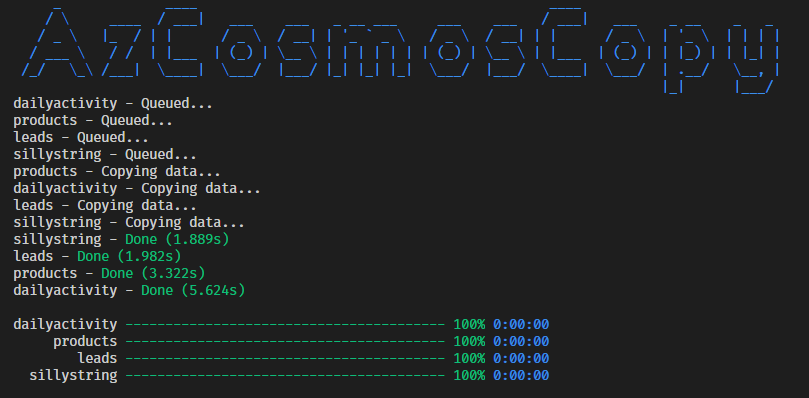

# AzCosmosCopy


[](https://www.nuget.org/packages/AzCosmosCopy/)


Simple CLI application which copies azure cosmos DB database to same or different cosmos account.



## Usage

By default the app will copy up to 10 containers in parallel with 100 documents in parallel per container. These can be tweaked with the `--pc` and `--pd` parameters to match your use-case. For example, if you you have only a few containers with tens of thousands of documents, you may want to increase the number of parallel documents and reduce the number of parallel containers. 

**Note** If your destination database account is on free tier (400 RU) the copy may fail if you do not slow down this app by changing the `parallel` arguments, as this application can quickly overwhelm your destination.

Install new
```sh
dotnet tool install -g azcosmoscopy
```

Upgrade to latest
```sh
dotnet tool update -g azcosmoscopy
```

Command line
```
Options:
  -s, --source <source>                                  Source connection string (required)
  --sd, --source-database <source-database>              Source database name (required)
  -d, --destination <destination>                        Destination connection string
  --dd, --destination-database <destination-database>    Destination database name
  --parallel-containers, --pc <parallel-containers>      Parallel container copies
  --parallel-documents, --pd <parallel-documents>        Parallel document copies
  -b, --bulk                                             Use bulk executor (serverless not supported)
  --dbscale <dbscale>                                    Destination database scale (serverless not supported)
  --dcscale <dcscale>                                    Destination container scale (serverless not supported)
  --version                                              Show version information
  -?, -h, --help                                         Show help and usage information
```

## Future
- Add support for rendering diagnostics via library with custom copyasync invocation